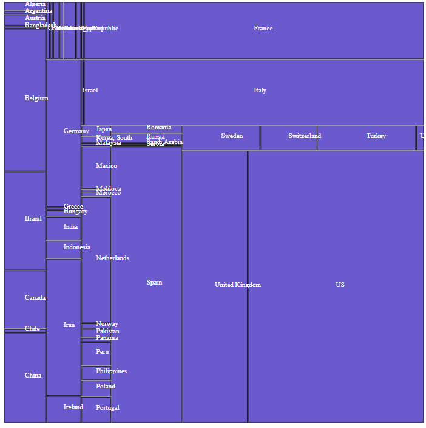
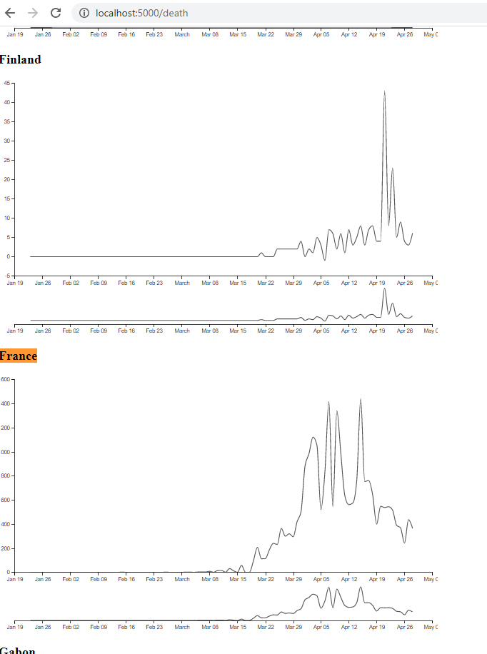

# mapd3jscovid19
a map d3js with timeline of evolution of covid19

it's just a bridge in flash to d3js html page of covid19 data. 
could be a starting point.

url:
/ world
/france/  france 
/usa/     USA

There's a lot of ressource and data on 
https://covidtracking.com/

Data from 
 https://github.com/CSSEGISandData/COVID-19/blob/master/csse_covid_19_data/csse_covid_19_time_series/time_series_covid19_confirmed_global.csv

Add few display from : 
https://pomber.github.io/covid19/timeseries.json

![Display case/ death .. by country] (bycountry.png)

